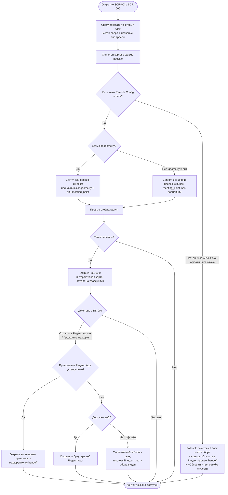

# Карта трассы

**ID:** LOGIC-006  
**Тип:** Логика  
**Домен:** 09. Логики  
**Приоритет:** Medium  
**Статус:** Черновик  
**Функциональные блоки:** FB-MAP-001 (Статичный превью трассы), FB-MAP-002 (Интерактивная карта BS-004)

---

## История изменений

| Релиз | ТЗ | Описание изменений |
|-------|-----|-------------------|
| — | — | Первоначальная документация |

---

## Входные данные

> Логика не делает отдельных запросов к нашему API. Данные приходят в составе ответа `getSlot` (SCR-003) / `getBooking` (SCR-006). Параметры внешнего сервиса берутся из Remote Config.

| Название | Тип | Возможные значения | Описание |
|----------|-----|-------------------|----------|
| `slot.geometry` | Состояние (ответ getSlot/getBooking) | массив пар `[lat, lng]` **или** строка encoded polyline | Геометрия трассы для отрисовки полилинии на карте. Может отсутствовать у слота. |
| `track_config.name` | Состояние | строка, напр. `Длинная трасса` | Название конфигурации трассы. Дублируется текстом под картой. |
| `track_config.type` | Состояние | `novice`, `experienced` | Тип конфигурации трассы (новичковая/опытная). Дублируется текстом под картой. |
| `slot.meeting_point` | Состояние | строка, напр. `Картинг-центр «Апекс», въезд 1` | Адрес/ориентир места сбора. Текстовый эквивалент карты (обязателен). |
| `slot.meeting_point_lat` | Состояние | число (широта), напр. `55.751` | Широта места сбора — координата пина. |
| `slot.meeting_point_lng` | Состояние | число (долгота), напр. `37.618` | Долгота места сбора — координата пина. |
| `yandex_maps_api_key` | Remote Config | строка | Ключ Yandex Static API / Maps JS API. Не хардкодится. |
| `yandex_maps_tiles_style` | Remote Config | строка (идентификатор стиля/набора тайлов) | Стиль тайлов карты. Не хардкодится. |

---

## Обзор

LOGIC-006 описывает сквозной компонент «Карта трассы» приложения «Апекс». На экранах с информацией о заезде клиенту показывается **статичный превью Яндекс.Карт** с выделенной линией трассы (`slot.geometry`) и пином места сбора (`meeting_point_lat/lng`). Тап по превью открывает шторку [BS-004 «Карта трассы»](../BS-004-track-map.md) с интерактивной картой (зум/пан, авто-fit на трассу+пин) и действиями передачи во внешнее приложение (handoff).

По умолчанию используется статика, а не тяжёлый интерактив: клиент стоит у трассы, важны экономия трафика/батареи и воспринимаемая скорость (P1/P4 в [foundations §4.5](../../3-design-brief/00-foundations.md)). Место сбора и название/тип конфигурации трассы **обязательно продублированы текстом** — карта не является единственным носителем информации (NFR-1, доступность).

### User Story

> Как клиент, я хочу увидеть трассу заезда и место сбора на карте,
> чтобы понять, куда мне приезжать и где проходит трасса, до записи и перед выездом.

### Бизнес-ценность

- Клиент заранее понимает географию трассы и точку сбора — меньше опозданий и неявок.
- Статичный превью экономит трафик/батарею у трассы и ускоряет открытие экрана (P4).
- Текстовое дублирование места сбора делает информацию доступной даже при недоступности карты и для screen reader (NFR-1).

---

## Точки применения

| Экран/Компонент | Элемент/Триггер | Условие |
|-----------------|-----------------|---------|
| [SCR-003 Карточка слота](../SCR-003-slot-card.md) | Статичный превью карты (при открытии экрана) | Всегда; при недоступности карты — текстовый фолбэк |
| [SCR-006 Детали брони](../SCR-006-booking-details.md) | Статичный превью карты (при открытии экрана) | Всегда; при недоступности карты — текстовый фолбэк |
| [BS-004 Карта трассы](../BS-004-track-map.md) | Интерактивная карта (открытие шторки по тапу на превью) | По тапу на превью карты |

---

## Флоу

---

## Описание логики

### Шаг 1: Немедленный показ текста

При открытии SCR-003 / SCR-006 текстовый блок места сбора (`slot.meeting_point`) и название/тип конфигурации трассы (`track_config.name`, `track_config.type`) отображаются **сразу**, не дожидаясь карты. Это текстовый эквивалент карты ([foundations §7](../../3-design-brief/00-foundations.md)); он остаётся видимым во всех состояниях карты.

### Шаг 2: Загрузка статичного превью

На месте карты показывается скелетон в форме превью (не пустой блок). Параллельно собирается запрос статичного изображения к Yandex Static API: ключ и стиль тайлов берутся из Remote Config (`yandex_maps_api_key`, `yandex_maps_tiles_style`), на изображение наносятся полилиния по `slot.geometry` и пин по `meeting_point_lat/lng`.

### Шаг 3: Успех — превью с действием

При успешной отрисовке превью заменяет скелетон. Превью имеет доступное имя (screen reader) и кликабельно. У превью есть подпись/CTA «Открыть карту ›».

### Шаг 4: Тап → BS-004

Тап по превью открывает шторку [BS-004](../BS-004-track-map.md) с интерактивной картой: отрисованы трасса и пин, выполнен авто-fit (карта масштабируется так, чтобы в кадр попали и полилиния, и пин), доступны зум и пан. В BS-004 — кнопки «Проложить маршрут» и «Открыть в Яндекс.Картах»: обе передают данные во внешнее картографическое приложение (handoff). In-app навигации в MVP нет.

### Шаг 5: Трасса без линии (`slot.geometry = null`) — Content-без-линии, не ошибка

Если `slot.geometry` отсутствует (`null`), но превью/карта в остальном доступны (есть ключ и сеть) — это **не ошибка и не фолбэк**, а отдельное состояние **Content-без-линии**: карта/превью всё равно строится, на ней показывается **пин места сбора** (`meeting_point_lat/lng`), полилиния не рисуется. Под картой остаётся текстовый блок места сбора и название/тип конфигурации трассы. Превью остаётся кликабельным → BS-004 (там карта тоже строится с пином без линии).

Это согласовано с BS-004 (строка «Успех без линии» в обработке ответа Yandex Maps JS API) и с каталогом Empty в [LOGIC-008 Шаг 3](LOGIC-008_Паттерн-состояний-экрана.md) — разновидность «Трасса на карте недоступна» (пин места сбора + текст). Это **не** Error-состояние: кнопка «Обновить» не показывается, повтор загрузки не требуется.

### Шаг 6: Фолбэк при недоступности карты (ошибка/офлайн/нет ключа)

Если ключ отсутствует в Remote Config, нет сети/офлайн или превью/карта не загрузились (ошибка API/таймаут) — превью заменяется фолбэком: текстовый блок места сбора остаётся видимым, под ним показывается ссылка «Открыть в Яндекс.Картах» (handoff). Остальной контент экрана (параметры слота, CTA «Записаться»/отмена) полностью доступен — экран не ломается.

**Разграничение причин (согласовано с BS-004):**
- **Ошибка сети / офлайн** при инициализации превью/карты — статичный превью загрузить нельзя (это сетевая статика), но **handoff во внешнее приложение Яндекс.Карты остаётся доступен** (внешнее приложение может работать офлайн на закэшированных картах). Снек об ошибке загрузки превью на SCR-003/SCR-006 — по каталогу [LOGIC-008 Шаг 6](LOGIC-008_Паттерн-состояний-экрана.md) (сетевой текст из [00-foundations §6](../../3-design-brief/00-foundations.md): «Не удалось загрузить. Проверьте соединение и попробуйте снова.»), действие «Обновить» = повтор загрузки превью.
- **Ошибка API карты / невалидный ключ** — повторная загрузка может помочь: фолбэк на текст + «Обновить» (повтор загрузки превью/карты). Те же тексты §6.
- **Нет ключа в Remote Config** — попытка загрузки превью не делается, «Обновить» не показывается; сразу текстовый фолбэк + ссылка-handoff «Открыть в Яндекс.Картах».

> **«Обновить» vs handoff-ссылка.** «Обновить» — это **повтор загрузки превью/карты** (имеет смысл при ошибке API/ключа и при восстановлении сети). Ссылка «Открыть в Яндекс.Картах» — это **только handoff** во внешнее приложение, она не перезагружает наш превью и доступна во всех вариантах фолбэка (в т.ч. офлайн).

### Шаг 7: Сбой handoff (внешнее приложение недоступно)

При тапе «Открыть в Яндекс.Картах» / «Проложить маршрут» (на SCR-003/SCR-006-фолбэке или в BS-004) приложение Яндекс.Карты может быть **не установлено**. Тогда выполняется деградация:
1. Открыть маршрут/точку в **вебе Яндекс.Карт** (браузер) по тому же deeplink/URL;
2. если и это невозможно — невозможность открытия обрабатывается (системный механизм / снек) и клиент остаётся в приложении; текстовый адрес места сбора (`slot.meeting_point`) виден как минимальный носитель «куда идти».

**Офлайн и handoff.** Сам handoff — это переключение во внешнее приложение: оно может работать офлайн на закэшированных картах, поэтому кнопка/ссылка handoff остаётся активной и в офлайн-фолбэке. Деградация в веб (п.1) офлайн не сработает — тогда применяется п.2 (системная обработка + текстовый адрес).

---

## API запросы / Интеграция с Яндекс.Картами

> К нашему API эта логика отдельных запросов **не делает** — `slot.geometry`, `meeting_point`, координаты приходят в составе ответа `getSlot` (SCR-003) / `getBooking` (SCR-006). Ниже — описание интеграции с внешним сервисом Яндекс.Карты.

### Интеграция: Yandex Static API (статичный превью)

**Триггер:** при открытии SCR-003 / SCR-006 (после получения данных слота/брони).

**Параметры запроса к Яндекс:**

| Параметр | Тип | Описание | Значение/Источник |
|----------|-----|----------|-------------------|
| ключ API | string | Авторизация Static API | `yandex_maps_api_key` (Remote Config) |
| стиль тайлов | string | Набор/стиль тайлов карты | `yandex_maps_tiles_style` (Remote Config) |
| полилиния трассы | geometry | Выделенная линия трассы | `slot.geometry` (ответ getSlot/getBooking) |
| метка (пин) | coords | Пин места сбора | `meeting_point_lat`, `meeting_point_lng` |
| размер изображения | string | Под размер контейнера превью | вычисляется клиентом |

**Обработка результата:**

| Результат | Действие |
|-----------|----------|
| Загрузка | Скелетон в форме превью; текстовый блок места сбора уже виден |
| Успех | Статичный превью с полилинией и пином; превью кликабельно → BS-004 |
| Успех без линии (`slot.geometry = null`) | **Content-без-линии**, не ошибка: превью строится с пином места сбора, полилиния не рисуется; превью кликабельно → BS-004. Согласовано с BS-004 и каталогом Empty в [LOGIC-008 Шаг 3](LOGIC-008_Паттерн-состояний-экрана.md) («Трасса на карте недоступна»). «Обновить» не показывается |
| Ошибка API карты / таймаут / невалидный ключ | Фолбэк: текстовый блок места сбора + «Обновить» (повтор загрузки превью) + ссылка «Открыть в Яндекс.Картах». Снек по [LOGIC-008 Шаг 6](LOGIC-008_Паттерн-состояний-экрана.md) / [00-foundations §6](../../3-design-brief/00-foundations.md) |
| Офлайн / нет сети | Фолбэк: текст + «Обновить» (повтор при восстановлении сети) + ссылка-handoff. **Handoff остаётся доступен** (внешнее приложение может работать офлайн). Снек — сетевой текст §6 |
| Нет ключа в Remote Config | Фолбэк: текст + ссылка-handoff; попытка загрузки превью не делается, «Обновить» не показывается |

### Интеграция: Yandex Maps JS API (интерактивная карта, BS-004)

**Триггер:** тап по превью → открытие BS-004.

- Отрисовка интерактивной карты с полилинией (`slot.geometry`) и пином (`meeting_point_lat/lng`), авто-fit на трассу+пин, зум/пан.
- При `slot.geometry = null` — **Content-без-линии**: карта строится с пином места сбора, полилиния не рисуется (не ошибка; согласовано с BS-004 и каталогом Empty в [LOGIC-008 Шаг 3](LOGIC-008_Паттерн-состояний-экрана.md)).
- Кнопка «Открыть в Яндекс.Картах» — handoff во внешнее приложение Яндекс.Карты (deeplink на координаты/маршрут).
- Кнопка «Проложить маршрут» — handoff во внешнее приложение для построения маршрута до места сбора.
- **Сбой handoff** (приложение Яндекс.Карт не установлено): деградация в **веб Яндекс.Карт (браузер)** по тому же URL; если и это невозможно (офлайн) — системная обработка / снек, клиент остаётся в приложении, текстовый адрес места сбора виден.
- **Офлайн.** Внешнее приложение Яндекс.Карт может работать офлайн на закэшированных картах, поэтому handoff остаётся активным; статичный превью (сетевая статика) офлайн недоступен.
- In-app навигации в MVP нет.

---

## Связанные требования

### Функциональные (REQ-FUNC-*)

| ID | Название | Приоритет |
|----|----------|-----------|
| FR-9a | Карточка слота со всеми параметрами заезда (включая конфигурацию трассы и её тип) — [ФТ](../../2-requirements/functional-requirements.md) | Must |
| US-4 | Открыть карточку слота со всеми параметрами, чтобы понять детали перед записью — [User stories](../../2-requirements/user-stories.md) | — |

### Интеграции (REQ-INT-*)

| ID | Название | Приоритет |
|----|----------|-----------|
| INT-YANDEX-MAPS | Интеграция с Яндекс.Картами: Static API (превью), Maps JS API (BS-004), handoff во внешнее приложение; ключ и стиль тайлов — Remote Config | Medium |

### UI (REQ-UI-*)

| ID | Название | Приоритет |
|----|----------|-----------|
| NFR-1 | Доступность: карта — не единственный носитель информации; место сбора и название/тип конфигурации трассы дублируются текстом — [НФТ](../../2-requirements/non-functional-requirements.md) | Высокий |

---

## Критерии приёмки

> Формат: **Дано** {контекст}, **Когда** {действие}, **Тогда** {результат}

| ID | Критерий |
|----|----------|
| AC-001 | **Дано** открыт SCR-003 / SCR-006 с валидными `slot.geometry` и `meeting_point_lat/lng` и доступным ключом из Remote Config, **Когда** загружается экран, **Тогда** на месте карты показывается статичный превью Яндекс с выделенной линией трассы и пином места сбора. |
| AC-002 | **Дано** на экране показан статичный превью карты, **Когда** клиент тапает по превью, **Тогда** открывается шторка BS-004 с интерактивной картой, отрисованной трассой и пином и авто-fit на трассу+пин. |
| AC-003 | **Дано** любой из экранов SCR-003 / SCR-006 открыт (карта доступна или нет), **Когда** клиент смотрит контент, **Тогда** место сбора (`slot.meeting_point`) и название/тип конфигурации трассы продублированы текстом под/рядом с картой. |
| AC-004 | **Дано** карта недоступна из-за ошибки API/ключа или офлайн/нет сети, **Когда** открывается экран, **Тогда** превью заменяется текстовым блоком места сбора с кнопкой «Обновить» (повтор загрузки превью) и ссылкой «Открыть в Яндекс.Картах» (handoff), а остальной контент экрана (параметры слота, CTA) остаётся доступным. |
| AC-004a | **Дано** ключ Яндекс отсутствует в Remote Config, **Когда** открывается экран, **Тогда** попытка загрузки превью не делается, кнопка «Обновить» не показывается, сразу виден текстовый блок места сбора + ссылка «Открыть в Яндекс.Картах». |
| AC-004b | **Дано** у слота отсутствует `slot.geometry` (`null`), но ключ и сеть доступны, **Когда** строится превью/карта, **Тогда** это трактуется как Content-без-линии: показывается пин места сбора без полилинии, превью остаётся кликабельным → BS-004, кнопка «Обновить» не показывается (не Error). |
| AC-004c | **Дано** приложение Яндекс.Карт не установлено, **Когда** клиент тапает «Открыть в Яндекс.Картах» / «Проложить маршрут», **Тогда** маршрут/точка открывается в вебе Яндекс.Карт (браузер), а при невозможности (офлайн) обрабатывается системно/снеком и клиент остаётся в приложении с видимым текстовым адресом места сбора. |
| AC-005 | **Дано** открыта шторка BS-004, **Когда** клиент нажимает «Проложить маршрут» или «Открыть в Яндекс.Картах», **Тогда** происходит handoff во внешнее картографическое приложение (без in-app навигации). |
| AC-006 | **Дано** идёт загрузка статичного превью, **Когда** превью ещё не получен, **Тогда** на месте карты отображается скелетон в форме превью, а текстовый блок места сбора уже виден. |
| AC-007 | **Дано** ключ Яндекс и стиль тайлов заданы в Remote Config, **Когда** собирается запрос к Яндекс.Картам, **Тогда** значения берутся из конфигурации и не хардкодятся в приложении. |

---

## Обработка ошибок

> **Разграничение (согласовано с BS-004).** **Отсутствие `slot.geometry`** — это **не ошибка**, а Content-без-линии (см. Шаг 5). **Ошибка сети** при инициализации превью/карты не блокирует handoff (внешнее приложение может работать офлайн), а **ошибка API карты / ключа** ведёт к фолбэку на текст + «Обновить». «Обновить» = повтор загрузки превью/карты; «Открыть в Яндекс.Картах» = только handoff.

| Тип ошибки | Контекст | Действие |
|------------|----------|----------|
| Ошибка API карты / таймаут / невалидный ключ | Static API на SCR-003 / SCR-006; JS API в BS-004 | Фолбэк: текстовый блок места сбора + **«Обновить»** (повтор загрузки превью/карты) + ссылка «Открыть в Яндекс.Картах»; снек по [LOGIC-008 Шаг 6](LOGIC-008_Паттерн-состояний-экрана.md) / [00-foundations §6](../../3-design-brief/00-foundations.md). Экран не ломается. |
| Ошибка сети / офлайн | Загрузка превью или открытие BS-004 | Превью (сетевая статика) недоступно → фолбэк на текст + «Обновить» (повтор при восстановлении сети); снек — сетевой текст «Не удалось загрузить. Проверьте соединение и попробуйте снова.» (§6). **Handoff остаётся доступен** (внешнее приложение может работать офлайн на закэшированных картах). |
| Нет ключа в Remote Config | Сборка запроса к Яндекс | Попытка загрузки превью не делается; сразу текстовый фолбэк + ссылка-handoff; «Обновить» не показывается. |
| `slot.geometry = null` (не ошибка) | Данные слота/брони | **Content-без-линии**: карта/превью строится с пином места сбора, полилиния не рисуется; «Обновить» не показывается. Разновидность Empty «Трасса на карте недоступна» — см. [LOGIC-008 Шаг 3](LOGIC-008_Паттерн-состояний-экрана.md). |
| Приложение Яндекс.Карт не установлено | Handoff из BS-004 / ссылки фолбэка | Деградация: открыть **веб Яндекс.Карт в браузере** по тому же URL; если невозможно (офлайн) — системная обработка / снек, клиент остаётся в приложении, виден текстовый адрес места сбора. |
