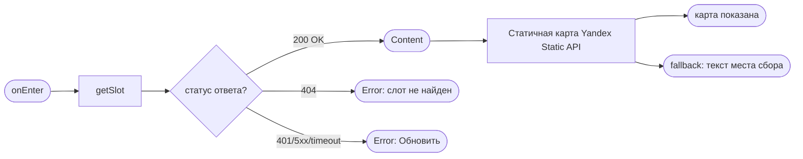
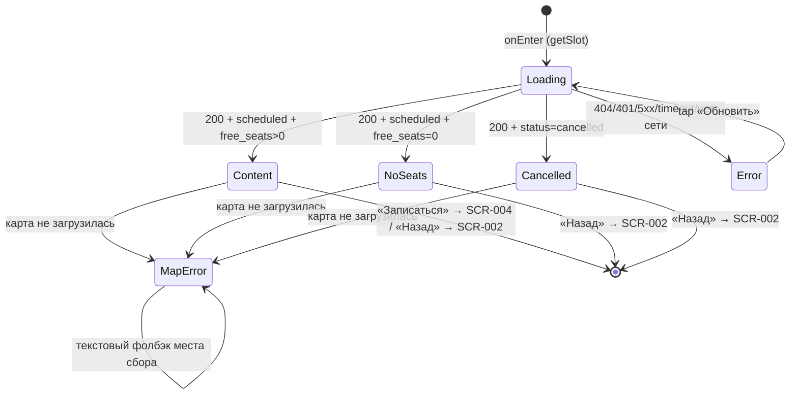

# Карточка слота

**ID:** SCR-003  
**Тип:** Экран  
**Домен:** 01. Просмотр заездов  
**Приоритет:** Critical  
**Статус:** Черновик  
**Функциональные блоки:** FB-SLOT-001 (Просмотр слота), FB-SLOT-002 (Переход к записи)  
**Зона авторизации:** АЗ  
**Дизайн-макет:** [Figma — Карточка заезда (71:6169)](https://www.figma.com/design/ySEt0cjmRqmhdWyDlTpDM5/Апекс-приложение?node-id=71-6169) · [Booking Sheet (71:14252)](https://www.figma.com/design/ySEt0cjmRqmhdWyDlTpDM5/Апекс-приложение?node-id=71-14252)

> **Дизайн-уточнения** ([RR-D06](../3-design-brief/design-review.md) / [RR-D07](../3-design-brief/design-review.md)):
> - **Иконка «Поделиться»** в хедере — **отложена (Phase 2) / декоративна**: функция в MVP **не специфицируется** (см. [feature-list §7](feature-list.md)).
> - На карточке добавлены **hero-обложка** (декоративное изображение трассы) и **описание конфигурации трассы** (составной текст: трасса + длительность + аудитория). Источник описания — `TrackConfig.description` из API (добавляет API-агент); при отсутствии — составляется на клиенте. Числа — из данных, не хардкод.

---

## Содержание

- [История изменений](#история-изменений)
- [Обзор](#обзор)
- [Навигация](#навигация)
- [Входные данные](#входные-данные)
- [Применяемые логики](#применяемые-логики)
- [Свойства Bottom Sheet](#свойства-bottom-sheet)
- [Инициализация](#инициализация)
- [Используемые запросы](#используемые-запросы)
- [Макет экрана](#макет-экрана)
- [Элементы экрана](#элементы-экрана)
- [Состояния экрана](#состояния-экрана)
- [Действия пользователя](#действия-пользователя)
- [Связанные требования](#связанные-требования)
- [Критерии приёмки](#критерии-приёмки)
---

## История изменений

| Релиз | ТЗ | Описание изменений |
|-------|-----|-------------------|
| 0.1.0 | [SCR-003 Карточка слота](SCR-003-slot-card.md) | Первичная версия ТЗ на основе дизайн-брифа SCR-003 v0.1 |

---

## Обзор

Экран показывает **все параметры одного заезда (слота)** — дату/время, конфигурацию трассы и её тип, длительность, маршала, цену за место, доступность мест и прокатной экипировки, карту трассы и место сбора. Назначение — дать клиенту полную и честную картину слота за один экран и предоставить один очевидный следующий шаг: «Записаться» — либо понятно объяснить, почему запись сейчас невозможна (мест нет / слот отменён).

Это вложенный экран без таб-бара — промежуточный шаг между списком слотов ([SCR-002](SCR-002-slot-list.md)) и оформлением записи ([SCR-004](SCR-004-booking.md)). Контекст использования — трасса, солнце, спешка перед заездом: клиенту нужно быстро считать ключевые числа (когда, где, сколько стоит, есть ли места).

### User Story

> Как клиент, я хочу открыть карточку слота со всеми параметрами,
> чтобы понять детали заезда перед записью и выбрать подходящий слот.

(US-4)

### Бизнес-ценность

- Снижает число несостоявшихся записей: клиент принимает решение, видя все условия (время, место сбора, цена, тип конфигурации трассы).
- Сокращает путь к записи до ≤ 3 экранов (NFR-2): SCR-002 → SCR-003 → SCR-004.
- Честно показывает отсутствие мест и отмену слота без давления (P6), сохраняя доверие к сервису.

---

## Навигация

### Входящая (откуда открывается)

| Источник | Триггер | Условие | Передаваемые параметры |
|----------|---------|---------|------------------------|
| [SCR-002 Список слотов](SCR-002-slot-list.md) | Тап по карточке слота | Всегда | `slotId` |

### Исходящая (куда ведёт)

| Назначение | Триггер | Передаваемые параметры |
|------------|---------|------------------------|
| [SCR-004 Оформление записи](SCR-004-booking.md) | Тап «Записаться» (активна при `free_seats > 0`) | `slotId` |
| [BS-004 Карта трассы](BS-004-track-map.md) | Тап по статичной карте / «Открыть карту» | `slotId` |
| [SCR-002 Список слотов](SCR-002-slot-list.md) | Тап «Назад» / системный жест | — |

> **Примечание (снеки действия записи):** на SCR-003 «Записаться» — это **только переход** на [SCR-004](SCR-004-booking.md) (передаётся `slotId`); запрос на создание брони здесь **не отправляется**. Все снеки/нотисы ошибок самого действия записи (нет мест / слот закрыт / дедлайн старта / гонка-овербукинг — `createBooking` → 409 `slot_full`/`double_booking`, 422 `slot_started`) обрабатываются **на [SCR-004](SCR-004-booking.md)** по [LOGIC-008](09_Логики/LOGIC-008_Паттерн-состояний-экрана.md) (Шаг 6, снек действия) и 00-foundations §6. На этой карточке снеков действия записи нет.

---

## Входные данные

| Название | Тип | Возможные значения | Описание |
|----------|-----|-------------------|----------|
| `slotId` | Состояние (параметр навигации) | UUID | Идентификатор слота, выбранного на [SCR-002](SCR-002-slot-list.md). Используется как path-параметр для [getSlot](#getslot). |

---

## Применяемые логики

| Логика | Элемент/Триггер | Описание |
|--------|-----------------|----------|
| [LOGIC-002 Расчёт доступности](09_Логики/LOGIC-002_Расчёт-доступности.md) | CTA «Записаться», блоки «Места» / «Прокатная экипировка» | Определяет активность CTA (`free_seats > 0`) и отображение доступности мест/прокатной экипировки; числа подставляются из данных слота, не хардкодятся. |
| [LOGIC-006 Карта трассы](09_Логики/LOGIC-006_Карта-трассы.md) | Блок «Карта трассы» | Статичный превью Яндекс-карты с полилинией трассы (`slot.geometry`) и пином места сбора; состояния загрузки/ошибки и текстовый фолбэк. |
| [LOGIC-008 Паттерн состояний экрана](09_Логики/LOGIC-008_Паттерн-состояний-экрана.md) | Весь экран | Loading / Content / Error и кнопка «Обновить» поверх ответа [getSlot](#getslot). |

---

## Свойства Bottom Sheet

> *Секция только для типа "Bottom Sheet". Для SCR-003 (Экран) не применяется — «—».*

—

---

## Инициализация

> **Примечание:** При открытии экрана отправляется один запрос [getSlot](#getslot) по `slotId`. Карта трассы рендерится из `slot.geometry`/`meeting_point` уже полученного ответа (отдельным запросом к API приложения не идёт — статичный тайл грузится через Яндекс Static API, см. [LOGIC-006](09_Логики/LOGIC-006_Карта-трассы.md)).

### Диаграмма загрузки



### Запросы при открытии

| № | Запрос | Критичный | Зависит от | Условие |
|---|--------|-----------|------------|---------|
| 1 | [getSlot](#getslot) | Да | — | Всегда |
| 2 | Статичный тайл карты (Яндекс Static API) | Нет | №1 | `slot.geometry != null` |

> Полное описание запросов см. в секции [Используемые запросы](#используемые-запросы).

---

## Используемые запросы

> Все API-запросы экрана с полным описанием параметров и обработки ответов. REST; GraphQL не используется.

### getSlot

**Тип:** REST  
**Метод:** GET  
**Спецификация:** [../api/slots/api.yaml](../api/slots/api.yaml) → `getSlot` (`GET /slots/{slotId}`)

**Триггер:** Инициализация

**Параметры:**

| Параметр | Тип | Обязательность | Источник | Описание |
|----------|-----|----------------|----------|----------|
| `slotId` | string (uuid), path | Да | Параметр навигации из [SCR-002](SCR-002-slot-list.md) | Идентификатор запрашиваемого слота. |

**Возвращаемая модель `Slot`** ([../api/slots/models.yaml](../api/slots/models.yaml) → `Slot`):

| Поле | Тип | Использование на экране |
|------|-----|-------------------------|
| `id` | uuid | Идентификатор; передаётся далее в SCR-004 / BS-004. |
| `start_at` | date-time | Дата и время старта (крупно). |
| `track_config.name` | string | Название конфигурации трассы (заголовок блока «Трасса»). |
| `track_config.type` | enum `novice` / `experienced` | Бейдж типа конфигурации трассы (новичковая / опытная) с текстовой подписью. |
| `track_config.duration_min` | integer | Длительность; блок показывается, если значение есть. |
| `slot.geometry` | array `[lat,lng]` \| encoded polyline | Полилиния трассы на статичной карте. |
| `marshal.name` | string | Имя маршала (без контактов). |
| `total_seats` | integer | Всего мест. |
| `free_seats` | integer | Свободно мест (ключевое число; влияет на CTA). |
| `free_rental_equipment` | integer | Свободно прокатных комплектов экипировки (числом). |
| `price` | integer (RUB) | Цена за одно место. |
| `meeting_point` | string | Текст места сбора (адрес/ориентир) — обязательный блок. |
| `meeting_point_lat` / `meeting_point_lng` | float | Координаты пина места сбора на карте. |
| `status` | enum `scheduled` / `cancelled` | `cancelled` → состояние «Слот отменён». |

> `rental_price` приходит в модели, но на SCR-003 не отображается (используется при расчёте итоговой суммы на [SCR-004](SCR-004-booking.md)).

**Обработка ответа:**

| Результат | Условие | UI-реакция |
|-----------|---------|------------|
| Загрузка | — | Скелетон-шиммер в форме блоков параметров + место под CTA |
| Успех | `status = scheduled` И `free_seats > 0` | Состояние **Content**: все параметры + активный CTA «Записаться» |
| Успех | `status = scheduled` И `free_seats = 0` | Состояние **NoSeats**: все параметры; CTA неактивна, пометка «Мест нет» |
| Успех | `status = cancelled` | Состояние **Cancelled**: параметры с пометкой «Заезд отменён»; CTA неактивна/скрыта |
| HTTP 404 | Слот не найден/удалён | Состояние **Error**: «Не удалось загрузить. Проверьте соединение и попробуйте снова.» + «Обновить» |
| HTTP 401 | — | Error state + «Обновить» (повторная авторизация по флоу приложения) |
| HTTP 5xx / default | — | Error state с кнопкой «Обновить» |
| Сеть | Нет соединения / timeout | Error state с кнопкой «Обновить» |

---

### Статичная карта (Яндекс Static API)

**Тип:** REST (внешний сервис — статичный тайл-изображение)  
**Спецификация:** см. [LOGIC-006 Карта трассы](09_Логики/LOGIC-006_Карта-трассы.md). Ключ Яндекс Static API — параметр конфигурации (в макет не зашивается).

**Триггер:** Инициализация (после [getSlot](#getslot))

**Параметры:**

| Параметр | Тип | Обязательность | Источник | Описание |
|----------|-----|----------------|----------|----------|
| полилиния трассы | geometry | Да | `slot.geometry` из [getSlot](#getslot) | Выделенная линия трассы на превью. |
| пин места сбора | координаты | Да | `meeting_point_lat`, `meeting_point_lng` из [getSlot](#getslot) | Маркер места сбора. |

**Обработка ответа:**

| Результат | Условие | UI-реакция |
|-----------|---------|------------|
| Загрузка | — | Скелетон в форме карты (не пустой блок) |
| Успех | тайл получен | Статичный превью трассы + пин; тап → [BS-004](BS-004-track-map.md) |
| Ошибка / офлайн / нет ключа | — | **Fallback на текст**: блок места сбора (`meeting_point`) + ссылка «Открыть в Яндекс.Картах»; остальные параметры и CTA остаются доступны |

---

## Макет экрана

### Структура

```
┌─────────────────────────────────┐
│ ‹ Назад   Карточка заезда     ⤴ │  ← фикс. хедер; ⤴ «Поделиться» — Phase 2/декор (RR-D06)
├─────────────────────────────────┤
│  ░░░░░░ hero-обложка трассы ░░░░│  ← декоративное изображение (RR-D07; плейсхолдер, если нет поля)
│  Сб, 20 июня · 18:00             │  ← start_at (крупно)
│                                  │
│  Заезд на трассе «Длинная        │  ← описание конфигурации трассы (RR-D07):
│  трасса» займёт 15 минут и       │     TrackConfig.description из API либо
│  подойдёт для опытных.           │     составной текст на клиенте
│                                  │
│  ┌─────────────────────────────┐ │
│  │ Трасса                      │ │
│  │ Длинная трасса              │ │  ← track_config.name
│  │ [ Опытная ] · ~15 мин       │ │  ← track_config.type · track_config.duration_min (если есть)
│  └─────────────────────────────┘ │
│  ┌─────────────────────────────┐ │
│  │ ░░ карта (превью Яндекс) ░░░ │ │  ← статичный превью трассы
│  │ ░╱‾‾╲__ линия трассы ░    │ │  ← slot.geometry + пин места сбора
│  │ [ Открыть карту › ]         │ │  ← тап → BS-004
│  │ 📍 Место сбора               │ │
│  │ Картинг-центр «Апекс», въезд 1│ │  ← meeting_point (текст)
│  └─────────────────────────────┘ │
│  ┌─────────────────────────────┐ │
│  │ Маршал                      │ │
│  │ Анна                        │ │  ← marshal.name (без контактов)
│  └─────────────────────────────┘ │
│  ┌─────────────────────────────┐ │
│  │ Места                       │ │
│  │ Свободно 10 из 14           │ │  ← free_seats / total_seats
│  └─────────────────────────────┘ │
│  ┌─────────────────────────────┐ │
│  │ Прокатная экипировка        │ │
│  │ Свободно 12 комплектов      │ │  ← free_rental_equipment (числом)
│  └─────────────────────────────┘ │
│  ┌─────────────────────────────┐ │
│  │ Цена                        │ │
│  │ 2500 ₽ за место             │ │  ← price (per-seat)
│  └─────────────────────────────┘ │
│  Оплата на месте: наличные или   │  ← напоминание (foundations §6)
│  перевод на карту.               │
│                                  │
├─────────────────────────────────┤
│        [   Записаться   ]        │  ← фикс. CTA (Мест нет — если 0)
└─────────────────────────────────┘
```

### Компоненты

| Компонент | Описание | Обязательность |
|-----------|----------|----------------|
| Хедер «Назад» + заголовок | Фикс. хедер, кнопка «Назад» → SCR-002, заголовок «Карточка заезда» / название конфигурации трассы | Да |
| Иконка «Поделиться» (хедер) | Декоративная/неактивная; функция **Phase 2** (RR-D06), в MVP не специфицируется | Опционально (декор) |
| Hero-обложка | Декоративное изображение трассы вверху карточки; при отсутствии поля изображения в API — **плейсхолдер** (RR-D07) | Опционально (декор) |
| Описание конфигурации трассы | Текст «Заезд на трассе "…" займёт N минут и подойдёт для …» — `TrackConfig.description` из API либо составной текст на клиенте (RR-D07) | Да |
| Блок «Дата и время» | `start_at`, крупно и контрастно | Да |
| Блок «Трасса» | `track_config.name` + бейдж `track_config.type` + длительность `track_config.duration_min` | Да (длительность — опционально) |
| Блок «Карта трассы + место сбора» | Статичный превью + пин + текст `meeting_point` | Да |
| Блок «Маршал» | `marshal.name` | Да |
| Блок «Места» | «Свободно `free_seats` из `total_seats`» | Да |
| Блок «Прокатная экипировка» | «Свободно `free_rental_equipment` комплектов» | Да |
| Блок «Цена» | «`price` ₽ за место» | Да |
| Напоминание об офлайн-оплате | Текст из foundations §6 | Да |
| Фикс. CTA «Записаться» | Во всю ширину, всегда виден | Да |

---

## Элементы экрана

> **Примечания:**
> - Числа не хардкодятся — подставляются из данных слота.
> - Состояния не передаются только цветом — дублируются текстом/иконкой/формой.

### 1. Хедер

| Элемент | Описание | Источник данных | Валидация | Действие |
|---------|----------|-----------------|-----------|----------|
| Кнопка «Назад» | Возврат к списку | — | — | Возврат на [SCR-002](SCR-002-slot-list.md) |
| Заголовок | «Карточка заезда» / `track_config.name` | `track_config.name` из [getSlot](#getslot) | — | — |
| Иконка «Поделиться» | Декоративная/неактивная; функция отложена на **Phase 2** (RR-D06) | — | — | — (в MVP действие не специфицируется) |

**Логика:**
- Иконка «Поделиться»: в MVP функция «поделиться слотом» **не реализуется** (Phase 2 / декор, RR-D06; см. [feature-list §7](feature-list.md)). Если в макете иконка кликабельна — действие не задаётся; рекомендуется показывать её неактивной либо скрыть.

### 2. Параметры слота (скролл-контент)

| Элемент | Описание | Источник данных | Валидация | Действие |
|---------|----------|-----------------|-----------|----------|
| Hero-обложка | Декоративное изображение трассы вверху карточки | поле изображения `TrackConfig`/`Slot` из [getSlot](#getslot) **при наличии**; иначе плейсхолдер | — | — |
| Описание конфигурации трассы | «Заезд на трассе "`track_config.name`" займёт `track_config.duration_min` минут и подойдёт для `{аудитория по track_config.type}`» | `TrackConfig.description` из [getSlot](#getslot) **при наличии**; иначе составляется на клиенте из `track_config.name` + `track_config.duration_min` + `track_config.type` | — | — |
| Дата и время | Старт заезда, крупно | `start_at` из [getSlot](#getslot) | — | — |
| Название конфигурации трассы | Заголовок блока «Трасса» | `track_config.name` из [getSlot](#getslot) | — | — |
| Бейдж типа конфигурации трассы | «Новичковая» / «Опытная» (текст, не только цвет) | `track_config.type` из [getSlot](#getslot) | — | — |
| Длительность | «~`track_config.duration_min` мин» | `track_config.duration_min` из [getSlot](#getslot) | — | — |
| Статичная карта трассы | Превью с линией трассы и пином | `slot.geometry`, `meeting_point_lat/lng` из [getSlot](#getslot) | — | Тап / «Открыть карту» → [BS-004](BS-004-track-map.md) |
| Текст места сбора | Адрес/ориентир под картой | `meeting_point` из [getSlot](#getslot) | — | — |
| Маршал | Имя, без контактов | `marshal.name` из [getSlot](#getslot) | — | — |
| Места | «Свободно `free_seats` из `total_seats`» | `free_seats`, `total_seats` из [getSlot](#getslot) | — | — |
| Прокатная экипировка | «Свободно `free_rental_equipment` комплектов» | `free_rental_equipment` из [getSlot](#getslot) | — | — |
| Цена | «`price` ₽ за место» | `price` из [getSlot](#getslot) | — | — |
| Напоминание об оплате | «Оплата на месте: наличные или перевод на карту.» | Статичный текст (foundations §6) | — | — |

**Логика:**
- Hero-обложка (RR-D07): декоративное изображение. Если в API нет поля изображения конфигурации трассы/слота — показывается **плейсхолдер** (нейтральная заглушка), карточка остаётся функциональной; обложка не несёт критичной информации (NFR-1).
- Описание конфигурации трассы (RR-D07): приоритетно берётся серверное `TrackConfig.description`; при его отсутствии собирается на клиенте из `track_config.name` + `track_config.duration_min` + аудитории по `track_config.type` («новичковая» → «подойдёт для новичков», «опытная» → «для опытных»). Числа (минуты) — из данных, **не хардкод**; сегмент длительности скрывается, если `track_config.duration_min` отсутствует.
- Блок «Длительность»: показывается только при наличии `track_config.duration_min`; при отсутствии скрывается без «прочерков».
- Блоки «Места» / «Прокатная экипировка»: [LOGIC-002](09_Логики/LOGIC-002_Расчёт-доступности.md) — числа из данных слота; детальный лимит `min(free_seats, track_config.capacity_cap, 4)` применяется на [SCR-004](SCR-004-booking.md).
- Блок «Карта трассы»: [LOGIC-006](09_Логики/LOGIC-006_Карта-трассы.md) — статичный превью; при ошибке/офлайн — текстовый фолбэк (место сбора + ссылка «Открыть в Яндекс.Картах»).

### 3. Фикс. нижний CTA

> **Примечание (скролл и фиксация):** нижний CTA **зафиксирован** и всегда виден (foundations §4.2), а контент с параметрами слота (секция 2) **скроллится** под фикс. хедером и над фикс. CTA. При длинном контенте или системном увеличении шрифта CTA не уезжает за пределы экрана и не перекрывается контентом (см. [AC-E02](#граничные-условия-edge-cases)).

| Элемент | Описание | Источник данных | Валидация | Действие |
|---------|----------|-----------------|-----------|----------|
| Кнопка «Записаться» | Primary, во всю ширину | `free_seats`, `status` из [getSlot](#getslot) | — | Переход на [SCR-004](SCR-004-booking.md) с `slotId` |
| Пометка «Мест нет» | Текст рядом/на кнопке при недоступности | `free_seats` из [getSlot](#getslot) | — | — |
| Пометка «Заезд отменён» | Текст при `status = cancelled` | `status` из [getSlot](#getslot) | — | — |

**Логика:**
- Кнопка «Записаться»: [LOGIC-002](09_Логики/LOGIC-002_Расчёт-доступности.md) — при тапе на активную кнопку → переход на [SCR-004](SCR-004-booking.md), передаётся `slotId`. Это **только переход**: создание брони (`createBooking`) и связанные снеки/нотисы ошибок действия (нет мест / слот закрыт / дедлайн / гонка) — на [SCR-004](SCR-004-booking.md), не на этой карточке (см. примечание о снеках в секции [Навигация](#исходящая-куда-ведёт)).

**Условия доступности:**
- Кнопка «Записаться» **активна**, если: `status = scheduled` И `free_seats > 0`.
- Кнопка «Записаться» **неактивна** с пометкой «Мест нет» (дублируется текстом, не только прозрачностью), если: `status = scheduled` И `free_seats = 0`. Тап не выполняет переход.
- Кнопка «Записаться» **неактивна/скрыта** с пометкой «Заезд отменён», если: `status = cancelled`.

---

## Состояния экрана

### Таблица состояний

| Состояние | Условие | Отображение |
|-----------|---------|-------------|
| Loading | Ожидание ответа [getSlot](#getslot) | Скелетон-шиммер в форме блоков + место под CTA |
| Content | 200 OK, `status = scheduled`, `free_seats > 0` | Все параметры + активный CTA «Записаться» |
| NoSeats | 200 OK, `status = scheduled`, `free_seats = 0` | Все параметры; CTA неактивна, пометка «Мест нет» |
| Cancelled | 200 OK, `status = cancelled` | Все параметры + пометка «Заезд отменён»; CTA неактивна/скрыта |
| Error | 404 / 401 / 5xx / timeout / нет сети | Заглушка «Не удалось загрузить. Проверьте соединение и попробуйте снова.» + «Обновить» |
| MapError | Карта не загрузилась (подсостояние карты) | Вместо превью — текст места сбора + ссылка «Открыть в Яндекс.Картах»; остальной экран и CTA работают |

### Диаграмма переходов



> **Примечание (Empty неприменим).** В диаграмме нет состояния **Empty**, и это намеренно. По [LOGIC-008](09_Логики/LOGIC-008_Паттерн-состояний-экрана.md) Empty — это «запрос успешен, но данных нет». [getSlot](#getslot) возвращает **один объект `Slot` или 404**: либо слот получен (→ Content / NoSeats / Cancelled — параметры всегда есть), либо слот не найден/удалён (404 → Error). Состояния «успех, но пусто» здесь не существует, поэтому Empty к экрану не применяется. Недоступность слота к моменту открытия (нет мест / отменён) — это **варианты Content** с изменённым CTA, а не Empty; 404 — это **Error**, а не Empty.

---

## Действия пользователя

| Действие | Элемент | Триггер | Результат |
|----------|---------|---------|-----------|
| Записаться | Кнопка «Записаться» | Tap | При `free_seats > 0` и `status = scheduled` → переход на [SCR-004](SCR-004-booking.md) с `slotId` |
| Записаться (заблокировано) | Кнопка «Записаться» | Tap | При `free_seats = 0` или `status = cancelled` → перехода нет (кнопка неактивна) |
| Открыть карту | Статичная карта / «Открыть карту» | Tap | Открытие шторки [BS-004](BS-004-track-map.md) с `slotId` |
| Вернуться | Кнопка «Назад» / системный жест | Tap / Swipe | Возврат на [SCR-002](SCR-002-slot-list.md) |
| Повторить загрузку | Кнопка «Обновить» (Error) | Tap | Повторный запрос [getSlot](#getslot) |

---

## Связанные требования

### Функциональные (REQ-FUNC-*)

| ID | Название | Приоритет |
|----|----------|-----------|
| FR-9a | Карточка слота со всеми параметрами заезда (дата/время, конфигурация трассы и тип, маршал, цена, всего/свободно мест, доступность прокатной экипировки) | Must |
| FR-30 | Показ цены заезда и фиксация записи; оплата офлайн (наличные / перевод) | Must |

### Интеграции (REQ-INT-*)

| ID | Название | Приоритет |
|----|----------|-----------|
| getSlot | `GET /slots/{slotId}` — полные данные слота ([../api/slots/api.yaml](../api/slots/api.yaml)) | Must |
| Яндекс Static API | Статичный превью карты трассы (см. [LOGIC-006](09_Логики/LOGIC-006_Карта-трассы.md)) | Must |

### UI (REQ-UI-*)

| ID | Название | Приоритет |
|----|----------|-----------|
| — | Mobile-first для трассы: крупные числа, контраст, тач-зоны ≥ 44–48 pt (foundations §3) | Must |
| — | Состояния не только цветом — дублируются текстом/иконкой (foundations §3.2, §7) | Must |
| — | Вложенный экран без таб-бара, фикс. хедер + фикс. CTA (foundations §4.1, §4.2) | Must |

### Данные (REQ-DATA-*)

| ID | Название | Приоритет |
|----|----------|-----------|
| — | Модель `Slot` ([../api/slots/models.yaml](../api/slots/models.yaml)) — read-only | Must |
| — | `marshal.name` без контактов маршала (foundations §8.2) | Must |

---

## Критерии приёмки

### Позитивные сценарии

| ID | Критерий | Приоритет |
|----|----------|-----------|
| AC-001 | **Дано** клиент открыл карточку слота со `status = scheduled` и `free_seats > 0`, **Когда** экран загружен, **Тогда** показаны дата/время старта, название и тип конфигурации трассы, имя маршала, цена за место, «свободно из всего» мест, число свободных прокатных комплектов экипировки, карта трассы и текст места сбора | P0 |
| AC-002 | **Дано** слот с `free_seats > 0` и `status = scheduled`, **Когда** клиент тапает «Записаться», **Тогда** происходит переход на [SCR-004](SCR-004-booking.md) с передачей `slotId` | P0 |
| AC-003 | **Дано** в данных слота присутствует `track_config.duration_min`, **Когда** экран загружен, **Тогда** показан блок длительности; **Дано** `track_config.duration_min` отсутствует, **Тогда** блок скрыт без прочерка | P1 |
| AC-004 | **Дано** клиент видит блок цены, **Когда** экран загружен, **Тогда** показано напоминание «Оплата на месте: наличные или перевод на карту.» (FR-30) | P0 |
| AC-005 | **Дано** клиент на карточке слота, **Когда** тапает по статичной карте или «Открыть карту», **Тогда** открывается шторка [BS-004](BS-004-track-map.md) с интерактивной картой и `slotId` | P1 |
| AC-006 | **Дано** клиент на карточке слота, **Когда** тапает «Назад», **Тогда** возврат к списку [SCR-002](SCR-002-slot-list.md) | P1 |
| AC-007 | **Дано** карточка слота загружена, **Когда** экран отрисован, **Тогда** показаны hero-обложка (или плейсхолдер при отсутствии поля изображения) и описание конфигурации трассы («Заезд на трассе "…" займёт N минут и подойдёт для …») — из `TrackConfig.description` либо составленное на клиенте; числа из данных, не хардкод (RR-D07) | P1 |
| AC-008 | **Дано** в дизайне в хедере есть иконка «Поделиться», **Когда** клиент её видит, **Тогда** функция в MVP не специфицируется (Phase 2/декор, RR-D06): действие «поделиться» не выполняется | P2 |

### Негативные сценарии

| ID | Критерий | Приоритет |
|----|----------|-----------|
| AC-N01 | **Дано** ответ [getSlot](#getslot) завершился ошибкой (404 / 5xx / нет сети), **Когда** открытие экрана, **Тогда** показана заглушка «Не удалось загрузить. Проверьте соединение и попробуйте снова.» и кнопка «Обновить»; **Когда** клиент тапает «Обновить», **Тогда** запрос повторяется | P0 |
| AC-N02 | **Дано** к моменту открытия слот заполнен (`status = scheduled`, `free_seats = 0`), **Когда** экран загружен, **Тогда** **все параметры слота остаются видны без изменений**, **меняется только CTA**: «Записаться» неактивна с текстовой пометкой «Мест нет» (дублируется текстом, не только прозрачностью); **Когда** клиент тапает по кнопке, **Тогда** перехода не происходит и снек действия не показывается (ошибки действия записи — на [SCR-004](SCR-004-booking.md)) | P0 |
| AC-N03 | **Дано** к моменту открытия слот отменён (`status = cancelled`), **Когда** экран загружен, **Тогда** **все параметры слота остаются видны**, **меняется только CTA**: «Записаться» неактивна или скрыта с пометкой «Заезд отменён», переход на запись недоступен | P0 |
| AC-N04 | **Дано** к моменту открытия слот стал недоступен (404 — слот удалён/не найден), **Когда** открытие экрана, **Тогда** экран переходит в **Error** (заглушка + «Обновить»), а **не** в Empty — состояния «успех, но пусто» у одиночного слота нет (см. [Состояния экрана](#состояния-экрана), примечание про Empty) | P0 |

### Граничные условия (Edge Cases)

| ID | Критерий | Приоритет |
|----|----------|-----------|
| AC-E01 | **Дано** карта трассы не загрузилась (ошибка / офлайн / нет ключа Яндекс), **Когда** экран открыт, **Тогда** вместо превью показан текстовый блок места сбора (`meeting_point`) и ссылка «Открыть в Яндекс.Картах», а остальные параметры и кнопка «Записаться» остаются доступны | P0 |
| AC-E02 | **Дано** включено системное увеличение шрифта, **Когда** экран открыт, **Тогда** layout не ломается, ключевые числа и CTA остаются читаемыми и не перекрыты (foundations §7) | P2 |
| AC-E03 | **Дано** `free_seats = 1` (последнее место), **Когда** экран загружен, **Тогда** показано «Свободно 1 из `total_seats`» и CTA «Записаться» активна | P2 |
| AC-E04 | **Дано** `free_rental_equipment = 0` при `free_seats > 0`, **Когда** экран загружен, **Тогда** показано «Свободно 0 комплектов», CTA «Записаться» остаётся активной (запись со своей экипировкой возможна; лимит проката применяется на SCR-004) | P2 |
