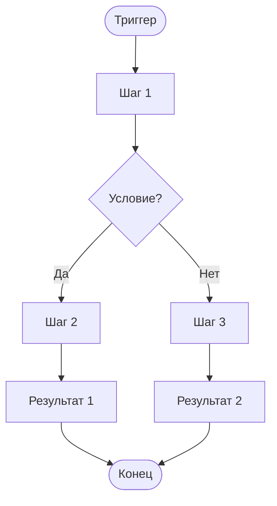

# {Название логики}

**ID:** LOGIC-XXX  
**Тип:** Логика  
**Домен:** 09. Логики  
**Приоритет:** {Critical | High | Medium | Low}  
**Статус:** {Черновик | На согласовании | Актуален | Устарел}  
**Функциональные блоки:** {FB-XXX-001, FB-XXX-002, ...}

---

## История изменений

| Релиз | ТЗ | Описание изменений |
|-------|-----|-------------------|
| {x.x.x} | [{Название ТЗ}]({ссылка}) | {Описание} |
| — | — | Первоначальная документация |

---

## Входные данные

> *Секция опциональна. Указывать, если логика зависит от кэша, состояния или Remote Config.*
>
> **Пример для «Апекс»:** `slot.geometry` (геометрия трассы), `track_config.capacity_cap` (потолок конфигурации), `free_rental_equipment` (свободная прокатная экипировка).

| Название | Тип | Возможные значения | Описание |
|----------|-----|-------------------|----------|
| `{inputName}` | {Кэш / Состояние / Remote Config / Защищённое хранилище} | `{value1}`, `{value2}` | {Описание} |

---

## Обзор

{Краткое описание логики: что она делает, в каком контексте применяется, какую задачу решает}

### User Story

> Как {роль пользователя}, я хочу {действие},
> чтобы {цель/польза}.
>
> **Пример для «Апекс»:**
> > Как клиент картинг-центра, я хочу записаться на заезд, указав число мест (себя и до 3 гостей) и выбрать для каждого места свою или прокатную экипировку, чтобы гарантированно занять место на заезде.

### Бизнес-ценность

- {Ценность 1}
- {Ценность 2}
- {Ценность 3}

---

## Точки применения

> **Важно:** Указывайте ссылки на документы. Если логика используется в переиспользуемом компоненте (карта трассы, блок цены), ссылайтесь на компонент вместо перечисления всех экранов.
>
> **Пример для «Апекс»:**
> - [SCR-003 Карточка слота](SCR-003-slot-card.md) — CTA «Записаться», блоки «Места» / «Прокатная экипировка»
> - [SCR-004 Оформление записи](SCR-004-booking.md) — степпер «Число мест», переключатели «Своя/Прокатная»

| Экран/Компонент | Элемент/Триггер | Условие |
|-----------------|-----------------|---------|
| [{ID} {Название}]({путь/к/документу.md}) | {Кнопка / При открытии / и т.д.} | {Условие или "Всегда"} |

---

## Флоу

> Диаграмма процесса в формате mermaid. Показывает основные шаги, ветвления и результаты.

---

## Описание логики

> *Секция опциональна. Используйте, если флоу требует детального пояснения по шагам.*

### Шаг 1: {Название шага}

{Описание шага}

### Шаг 2: {Название шага}

{Описание шага}

---

## API запросы

> *Секция опциональна. Указывать, если логика включает обращение к API.*
>
> **Примеры для «Апекс»:**
> - `POST /bookings` → `createBooking` (создание брони)
> - `POST /bookings/{bookingId}/cancel` → `cancelBooking` (отмена брони)
> - `POST /auth/request-code` → `requestAuthCode` (запрос OTP)
> - `GET /slots` → `listSlots` (список слотов)

### {METHOD} {endpoint}

**Триггер:** {Описание триггера, например: "Тап на кнопку", "При открытии экрана"}

**Headers:**

| Поле | Описание |
|------|----------|
| `authorization` | Bearer токен пользователя |
| `deviceuuid` | ID устройства |

**Параметры/Body:**

| Параметр | Тип | Описание | Значение/Источник |
|----------|-----|----------|-------------------|
| `{param}` | {string/int/bool} | {Описание} | {Откуда берётся значение} |

**Обработка ответа:**

| Результат | Действие |
|-----------|----------|
| Загрузка | {Индикатор загрузки: лоадер, скелетон, шиммер} |
| Успех (200) | {Описание успешного сценария} |
| Ошибка 4xx | {Снек с текстом из `message` / другое} |
| Ошибка 5xx | Снек "Произошла ошибка. Попробуйте позже" |
| Ошибка сети | Снек "Нет соединения. Проверьте подключение к интернету" |

---

## Локальное хранение

> *Секция опциональна. Указывать, если логика сохраняет данные локально.*
>
> **Пример для «Апекс»:**
> - `access_token` / `refresh_token` — защищённое хранилище (Keychain/Keystore)
> - `push_permission_requested` — локальный кэш
> - `appliedFilters` — состояние экрана

| Ключ | Тип хранения | Описание |
|------|--------------|----------|
| `{key_name}` | {Локальный кэш / Защищённое хранилище} | {Описание} |

---

## Связанные требования

### Функциональные (REQ-FUNC-*)

| ID | Название | Приоритет |
|----|----------|-----------|
| REQ-FUNC-XXX | {Название} | {Critical / High / Medium / Low} |

### Интеграции (REQ-INT-*)

| ID | Название | Приоритет |
|----|----------|-----------|
| REQ-INT-XXX | {Название} | {Critical / High / Medium / Low} |

### UI (REQ-UI-*)

> *Секция опциональна. Указывать, если есть специфичные UI-требования.*

| ID | Название | Приоритет |
|----|----------|-----------|
| REQ-UI-XXX | {Название} | {Critical / High / Medium / Low} |

### Данные (REQ-DATA-*)

> *Секция опциональна. Указывать, если есть требования к хранению данных.*

| ID | Название | Приоритет |
|----|----------|-----------|
| REQ-DATA-XXX | {Название} | {Critical / High / Medium / Low} |

---

## Критерии приёмки

> Формат: **Дано** {контекст}, **Когда** {действие}, **Тогда** {результат}
>
> **Пример для «Апекс»:**
> > **Дано** клиент на экране оформления записи со свободными местами, **Когда** он выбирает «Прокатная экипировка» для части мест, **Тогда** итоговая цена пересчитывается с учётом тарифа проката (`rental_price × rental_count`).

| ID | Критерий |
|----|----------|
| AC-001 | **Дано** {контекст}, **Когда** {действие}, **Тогда** {результат} |
| AC-002 | **Дано** {контекст}, **Когда** {действие}, **Тогда** {результат} |
| AC-003 | **Дано** {контекст}, **Когда** {действие}, **Тогда** {результат} |

---

## Обработка ошибок

> *Секция опциональна. Указывать, если есть специфичная обработка ошибок.*
>
> **Пример для «Апекс»:**
> - `409 slot_full` → E1/E3 (нехватка мест / гонка) — откат `seats_count`, форма разблокирована
> - `422 slot_started` → слот стартовал, запись недоступна, CTA скрыт
> - `410 slot_cancelled` → слот отменён центром, «Вернуться к слотам»

| Тип ошибки | Контекст | Действие |
|------------|----------|----------|
| {Ошибка 1} | {Где возникает} | {Что делать} |
| {Ошибка 2} | {Где возникает} | {Что делать} |
