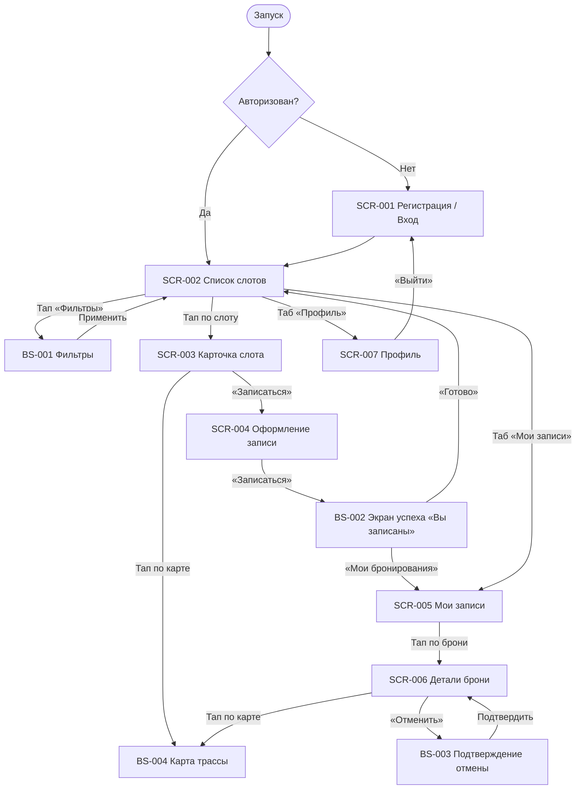

# Фича-лист мобильного приложения «Апекс»

> **Этап 5.** Перечень экранов клиентского приложения и доступных на них функций.
> Связующий артефакт между [требованиями](../2-requirements/) и детальным ТЗ по экранам
> (будущее заполнение [`_SCREEN_TEMPLATE.md`](_SCREEN_TEMPLATE.md)).

**Статус:** Черновик · **Версия:** 0.1 · **Дата:** 2026-06-15

---

## 1. Назначение

**«Апекс»** — клиентское мобильное приложение для самостоятельной записи на заезды уличного
картинг-центра. Заменяет ручную запись через Telegram и доску маркером,
устраняя двойные брони и путаницу с местами.

**Скоуп приложения — только роль «Клиент».** Маршал и Владелец работают через
существующую инфраструктуру/админку и в приложение **не входят**. Справочные данные (слоты,
конфигурации трасс, маршалы) приложение получает из API в режиме **read-only**; оплата — **офлайн**
(наличные / перевод), приложение лишь показывает цену и фиксирует запись.

**Источники:**
[Бриф](../0-customer-brief/customer-brief.md) ·
[Бизнес-требования](../2-requirements/business-requirements.md) ·
[Функциональные требования](../2-requirements/functional-requirements.md) ·
[Нефункциональные требования](../2-requirements/non-functional-requirements.md) ·
[Use cases](../2-requirements/use-cases.md) ·
[User stories](../2-requirements/user-stories.md) ·
[Модель данных](../4-design/data-model.md) ·
[API (OpenAPI, многофайловый)](../api/redocly.yaml)

---

## 2. Глоссарий и роли

| Термин | Значение |
|--------|----------|
| **Заезд / Слот** | Конкретный заезд группы: дата, время старта, конфигурация трассы, маршал, цена, всего/свободно мест. |
| **Конфигурация трассы** | Вариант заезда (новичковая / опытная). У каждой конфигурации — свой потолок мест и длительность. |
| **Экипировка** | Картинг-инвентарь (шлем + подшлемник). Бывает прокатной (из прокатного фонда центра) или собственной (клиент со своей экипировкой). |
| **Запись** | Бронь клиента на слот: число мест (себя + гости), вариант экипировки для каждого места, статус. |
| **Ранняя отмена** | Отмена не позднее чем за 2 часа до старта → места возвращаются в слот. |
| **Поздняя отмена** | Отмена менее чем за 2 часа до старта → запись фиксируется, место **не** освобождается, штрафов нет. |

**Роль приложения:** **Клиент** — просматривает и фильтрует слоты, записывается (себя и
гостей), выбирает вариант экипировки, отменяет записи, получает напоминания.

> **Принцип абстракции.** В фича-листе **не привязываемся к конкретным числам** (размер
> прокатного фонда, потолки конфигураций трасс, длительность). Все лимиты — параметры, приходящие из
> данных/конфигурации слота и конфигурации трассы.
>
> **Раздельная модель доступности (места ≠ прокатный фонд).** Места и прокатный фонд считаются
> **независимо**:
> - **Лимит мест группы:** `max_seats = min(free_seats, track_config.capacity_cap, 4)` — все значения
>   из данных слота/конфигурации трассы (групповой лимит `4` — «себя + до 3 гостей», FR-12).
> - **Лимит прокатного фонда:** `rental_count ≤ free_rental_equipment`.
>
> «Своя экипировка» занимает место в группе, но **не** уменьшает прокатный фонд; «Прокатная» —
> занимает место **и** уменьшает прокатный фонд. То есть доступность мест **не** считается «через
> прокатные комплекты» — это два разных лимита.
>
> **Лимит мест — 4** (согласовано с заказчиком). Подпись на макете «Оформление записи»
> «Можно записать до 4 мест» — **корректна** для картинг-центра; ТЗ лимит подтверждает.

---

## 3. Карта навигации

---

## 4. Инвентарь экранов

| ID | Экран | Тип | Назначение | Зона | Приоритет | Требования |
|----|-------|-----|------------|------|-----------|------------|
| **SCR-001** | Регистрация / Вход | Экран | Лёгкий вход по имени и телефону без пароля | НЗ | Critical | FR-1, FR-2 / US-1 |
| **SCR-002** | Список слотов | Экран | Каталог заездов со свободными местами + фильтры | АЗ | Critical | FR-9, FR-38 / UC-3, US-2, US-3 |
| **BS-001** | Фильтры | Bottom Sheet | Фильтрация списка слотов | АЗ | High | FR-38 / US-3 |
| **SCR-003** | Карточка слота | Экран | Полные параметры заезда перед записью | АЗ | Critical | FR-9a / US-4 |
| **SCR-004** | Оформление записи | Экран | Выбор числа мест, вариантов экипировки, цена, запись | АЗ | Critical | FR-10–15, FR-30 / UC-1, US-5–8, US-11 |
| **BS-002** | Подтверждение записи («Вы записаны») | Экран | Полноэкранное подтверждение успешной брони со сводкой и двумя кнопками (RR-D03) | АЗ | High | FR-30 / US-5 |
| **SCR-005** | Мои записи | Экран | Список предстоящих и прошедших записей | АЗ | Critical | FR-35a / US-9 |
| **SCR-006** | Детали брони + отмена | Экран | Детали записи и запуск отмены | АЗ | Critical | FR-16–18 / UC-2, US-10 |
| **BS-003** | Подтверждение отмены | Bottom Sheet | Показ правила 2 часов и подтверждение отмены | АЗ | High | FR-17, FR-18 / US-10 |
| **BS-004** | Карта трассы | Bottom Sheet | Интерактивная карта Яндекс с отрисованной трассой и местом сбора | АЗ | Medium | FR-9a / US-4 |
| **SCR-007** | Профиль клиента | Экран | Просмотр/редактирование имени и телефона, выход, удаление аккаунта | АЗ | Medium | FR-1, FR-2 / NFR-12 |

> **Зоны:** НЗ — неавторизованная зона, АЗ — авторизованная зона.

---

## 5. Детализация по экранам

### SCR-001 · Регистрация / Вход

- **Назначение:** минимальный порог входа — регистрация и повторный вход по телефону.
- **Зона:** НЗ.
- **Доступные функции:**
  - Ввод имени и номера телефона (без пароля).
  - Подтверждение входа (код/сессия — детали на стороне бэкенда).
  - Повторный вход по номеру телефона.
- **Ключевые элементы:** поле «Имя», поле «Телефон», кнопка «Продолжить».
- **Бизнес-правила/валидации:** валидация формата имени и телефона; отсутствие сложного
  пароля (NFR-3); ≤ минимально необходимых полей (NFR-2).
- **Требования:** FR-1, FR-2 / US-1 / NFR-3.

### SCR-002 · Список слотов

- **Назначение:** главный экран — список доступных заездов; точка входа в запись.
- **Зона:** АЗ.
- **Доступные функции:**
  - Просмотр списка слотов (по умолчанию — **ближайшие 7 дней**, `only_available=false`; больший период — фильтром дат).
  - Открыть шторку фильтров [BS-001](#bs-001--фильтры).
  - Переход в карточку слота [SCR-003](#scr-003--карточка-слота).
  - Pull-to-refresh для обновления доступности.
  - Переходы в «Мои записи» и «Профиль».
- **Ключевые элементы:** карточка слота (дата/время старта, конфигурация трассы и тип, маршал,
  цена, всего/свободно мест); индикатор активных фильтров.
- **Бизнес-правила/валидации:** список показывает слоты на **ближайшие 7 дней** (дефолт API; больший период — фильтром дат); заполненные
  (свободных мест нет) и отменённые слоты **не скрываются**, а помечаются «Мест нет» с
  **неактивной CTA «Записаться»**; счётчик свободных мест отражает актуальные данные слота. По
  умолчанию `only_available=false`; скрыть заполненные можно фильтром «только со свободными
  местами» (BS-001).
- **Требования:** FR-9, FR-38 / UC-3, US-2, US-3 / NFR-6.

### BS-001 · Фильтры

- **Назначение:** уточнить список слотов под запрос клиента.
- **Зона:** АЗ.
- **Доступные функции:**
  - Фильтр по дате / периоду старта.
  - Фильтр по типу конфигурации трассы (новичковая / опытная).
  - Фильтр «только со свободными местами».
  - Фильтр по маршалу.
  - Применить / Сбросить фильтры.
- **Бизнес-правила/валидации:** фильтры комбинируются по «И»; при пустом результате —
  empty state с подсказкой изменить/сбросить фильтры (UC-3 A1, E1).
- **Требования:** FR-38 / US-3.

### SCR-003 · Карточка слота

- **Назначение:** показать все параметры заезда, чтобы клиент решил записаться.
- **Зона:** АЗ.
- **Доступные функции:**
  - Просмотр полных параметров слота.
  - Переход к оформлению записи [SCR-004](#scr-004--оформление-записи).
- **Ключевые элементы:** дата/время, конфигурация трассы и её тип, **карта трассы (статичный превью
  Яндекс с выделенной линией)**, **место сбора** (пин на карте + текст), маршал, цена,
  всего/свободно мест, доступность прокатной экипировки; кнопка «Записаться».
- **Бизнес-правила/валидации:** кнопка «Записаться» неактивна, если свободных мест нет; место
  сбора — обязательный элемент; тап по карте открывает интерактивную карту / Яндекс.Карты.
- **Требования:** FR-9a / US-4.

### SCR-004 · Оформление записи

- **Назначение:** собрать параметры брони и зафиксировать запись.
- **Зона:** АЗ.
- **Доступные функции:**
  - Выбор числа мест: себя + 1–3 гостя.
  - Выбор варианта экипировки (своя / прокатная) для каждого места.
  - Просмотр итоговой цены.
  - Подтверждение записи → [BS-002](#bs-002--подтверждение-записи-вы-записаны).
- **Ключевые элементы:** счётчик мест, переключатели «своя/прокатная» по местам, блок цены,
  кнопка «Записаться».
- **Бизнес-правила/валидации:**
  - Места и прокатный фонд — **два независимых лимита**: `max_seats = min(free_seats,
    track_config.capacity_cap, 4)` для мест и `rental_count ≤ free_rental_equipment` для проката — значения
    из данных слота/конфигурации трассы, не хардкодим.
  - Запись «своя экипировка» занимает место в группе, но **не** уменьшает прокатный фонд;
    «прокатная» — занимает место **и** уменьшает прокатный фонд (FR-14).
  - Запрет записи сверх лимита мест или свободных прокатных комплектов экипировки (FR-13, FR-15).
  - Защита от двойной брони и овербукинга при параллельных записях (NFR-8).
  - Обработка ошибок: нехватка мест (E1), нехватка прокатной экипировки с предложением
    уменьшить число прокатных / выбрать «свою» (E2), гонка запросов (E3), сетевой сбой
    без частичного повтора (E4) — см. [UC-1](../2-requirements/use-cases.md).
- **Требования:** FR-10–15, FR-30 / UC-1, US-5, US-6, US-7, US-8, US-11 / NFR-2, NFR-8.

### BS-002 · Подтверждение записи («Вы записаны»)

- **Назначение:** подтвердить успешную бронь и показать дальнейшие шаги.
- **Тип:** **Экран** (в дизайне — полноэкранный успех, а не Bottom Sheet; RR-D03). ID сохранён.
- **Зона:** АЗ.
- **Доступные функции:**
  - Просмотр сводки записи (слот, число мест, экипировка, цена).
  - Напоминание об офлайн-оплате (наличные / перевод).
  - Переход в «Мои записи» [SCR-005](#scr-005--мои-записи) (primary).
  - «Готово» — возврат к списку «Заезды» [SCR-002](#scr-002--список-слотов) (secondary).
- **Бизнес-правила/валидации:** запись появляется в «Моих записях»; свободные места
  слота уменьшены. Свободного закрытия свайпом/бэкдропом нет — уход только по двум кнопкам.
- **Требования:** FR-30 / US-5.

### SCR-005 · Мои записи

- **Назначение:** контроль предстоящих и прошедших заездов клиента.
- **Зона:** АЗ.
- **Доступные функции:**
  - Просмотр списка своих записей (предстоящие / прошедшие).
  - Переход к деталям брони [SCR-006](#scr-006--детали-брони--отмена).
- **Ключевые элементы:** карточка записи (статус, параметры слота, число мест, вариант экипировки).
- **Бизнес-правила/валидации:** клиент видит только свои записи (NFR-12); empty state, если
  записей нет.
- **Требования:** FR-35a / US-9 / NFR-12.

### SCR-006 · Детали брони + отмена

- **Назначение:** показать полную информацию о брони и дать отменить её.
- **Зона:** АЗ.
- **Доступные функции:**
  - Просмотр деталей записи и статуса.
  - Запуск отмены → [BS-003](#bs-003--подтверждение-отмены).
- **Ключевые элементы:** статус, дата/время, конфигурация трассы и тип, **карта трассы (статичный превью
  Яндекс)**, **место сбора** (пин + текст), маршал, число мест, вариант экипировки, цена;
  кнопка «Отменить».
- **Бизнес-правила/валидации:**
  - Кнопка «Отменить» доступна только до старта заезда (E1).
  - Повторная отмена уже отменённой записи не выполняется (E2).
- **Требования:** FR-16, FR-17, FR-18 / UC-2, US-10.

### BS-003 · Подтверждение отмены

- **Назначение:** объяснить последствия отмены и подтвердить действие.
- **Зона:** АЗ.
- **Доступные функции:**
  - Просмотр правила 2 часов и текущего статуса (ранняя / поздняя отмена).
  - Подтверждение / отказ от отмены.
- **Бизнес-правила/валидации:**
  - **Ранняя отмена** (≥ 2 ч до старта): места возвращаются в слот (FR-17).
  - **Поздняя отмена** (< 2 ч до старта): запись помечается «поздняя отмена», место **не**
    освобождается, штрафов нет (FR-18).
  - Время отсечки вычисляется от времени старта слота.
- **Требования:** FR-17, FR-18 / US-10.

### SCR-007 · Профиль клиента

- **Назначение:** контактные данные, выход и удаление аккаунта (входит в MVP).
- **Зона:** АЗ.
- **Доступные функции:**
  - Просмотр и редактирование имени и телефона (смена телефона — с подтверждением кодом из SMS).
  - Выход из аккаунта.
  - Удаление аккаунта (с обязательным подтверждением).
- **Бизнес-правила/валидации:** доступ только к собственным данным (NFR-11, NFR-12); при
  удалении аккаунта активные брони аннулируются и освобождают места, прошедшие —
  анонимизируются.
- **Требования:** FR-1, FR-2 / NFR-11, NFR-12.

---

## 6. Сквозные функции (не отдельные экраны)

- **Напоминания / уведомления** (FR-33, NFR-13): заблаговременное напоминание о предстоящей
  записи; уведомление об отмене заезда владельцем/маршалом. Канал в MVP — **системный
  push** (приложение регистрирует push-токен, доставку обеспечивает существующая
  инфраструктура). SMS / email / inbox — Phase 2.
- **Состояния экранов**: единый паттерн Loading (скелетон/шиммер) → Content → Empty (заглушка
  с подсказкой) → Error (с кнопкой «Обновить»). Применяется ко всем экранам со запросами.
- **NFR, влияющие на UI**: mobile-first для использования у трассы — крупные элементы,
  высокий контраст (NFR-1); запись ≤ 3 экранов до подтверждения (NFR-2); отклик списка и
  подтверждения < 2–3 с (NFR-6). Приложение — нативное/гибридное, распространяется через
  App Store / Google Play; веб-версии (работы в мобильном браузере) нет.

---

## 7. Не входит в MVP (Phase 2+)

| Функция | Причина / источник |
|---------|--------------------|
| **Рейтинг маршала** (1–5 звёзд + отзыв после заезда) | **Решение зафиксировано: Phase 2** (осознанное сужение скоупа MVP, перенос согласован с заказчиком 2026-06-25). В MVP не входит. |
| **Поделиться заездом (share)** — Phase 2 | На карточке слота [SCR-003](#scr-003--карточка-слота) в дизайне есть иконка «Поделиться», но функция в MVP **не специфицируется** (декор/отложено; RR-D06). |
| Онлайн-оплата | На старте оплата офлайн (BR-8, FR-30); онлайн — за рамками скоупа. |
| Авто-отмена по погоде | Владелец/маршал отменяют вручную, приложение уведомляет; авто-прогноз — позже. |
| Программа лояльности | Бейджи, скидки, приоритетная запись — не в MVP (NFR-16). |
| Публичные отзывы / рейтинги для клиентов | Агрегаты видит только админ; публичный показ — позже. |
| Мобильные интерфейсы маршала и владельца | Эти роли работают через существующую инфраструктуру/админку. |

---

## 8. Трассировка требований → экраны

| Требование | Покрывающий экран/функция |
|------------|----------------------------|
| FR-1, FR-2 (регистрация/авторизация) | SCR-001, SCR-007 |
| FR-9 (список слотов) | SCR-002 |
| FR-9a (карточка слота) | SCR-003 |
| FR-38 (фильтрация) | SCR-002 + BS-001 |
| FR-10–15 (запись, экипировка, лимиты) | SCR-004 |
| FR-30 (цена, офлайн-оплата) | SCR-003, SCR-004, BS-002 |
| FR-35a (список своих броней) | SCR-005 |
| FR-16, FR-17, FR-18 (отмена, правило 2 ч) | SCR-006 + BS-003 |
| FR-33 (напоминания) | Сквозная функция (§6) |
| UC-1 (запись) | SCR-002 → SCR-003 → SCR-004 → BS-002 |
| UC-2 (отмена) | SCR-005 → SCR-006 → BS-003 |
| UC-3 (фильтрация) | SCR-002 + BS-001 |

---

## 9. Замечания по данным

- **Рейтинг маршала** — решение зафиксировано: **Phase 2** (осознанное сужение скоупа
  MVP). В MVP функция не входит; расхождение источников снято — единое решение действует для
  всех артефактов этапа.
- **API описан** в многофайловой OpenAPI-спецификации [`../api/`](../api/) (точка входа —
  [`../api/redocly.yaml`](../api/redocly.yaml)). Домены: **auth** (запрос/проверка кода,
  logout), **profile** (профиль, смена телефона, удаление), **slots** (список/фильтрация и
  карточка, read-only), **bookings** (создание, список, отмена), **marshals** (справочник,
  read-only).
- Ссылки на `rigla_network/...` в [`_SCREEN_TEMPLATE.md`](_SCREEN_TEMPLATE.md) — артефакт
  шаблона из стороннего (аптечного) проекта; к «Апекс» не относятся и в фича-листе не
  используются.
